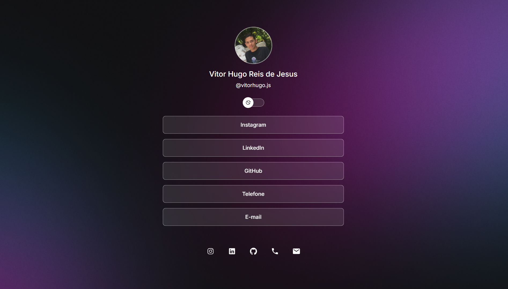

<h1 align="center">📱 Meus Links</h1>

Projeto simples com meus links para contato e redes sociais.

  <a href="#-tecnologias">Tecnologias</a>&nbsp;&nbsp;|&nbsp;&nbsp;
  <a href="#-projeto">Projeto</a>

## 🚀 Tecnologias

Esse projeto foi desenvolvido com:

- HTML  
- CSS  
- JavaScript  
- Figma (design)

## 💻 Projeto

O **Meus Links** é um agregador de links para usar como cartão de visitas online. Perfeito para incluir na bio do Instagram, currículo ou portfólio.

🧪 Totalmente responsivo e com estilo visual moderno.  
🌐 Acesse aqui: [https://vitorhugoreis.vercel.app/](https://vitorhugoreis.vercel.app/)

## 📸 Preview

  

 

Feito com 💙 por <strong>Vitor Hugo</strong>

